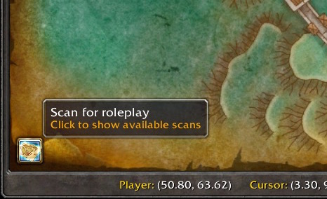
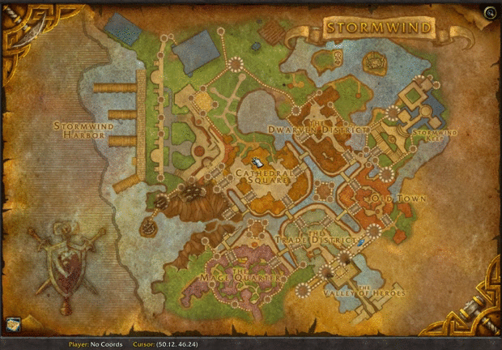
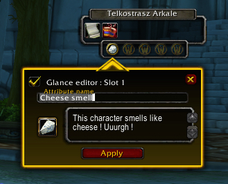
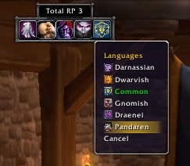
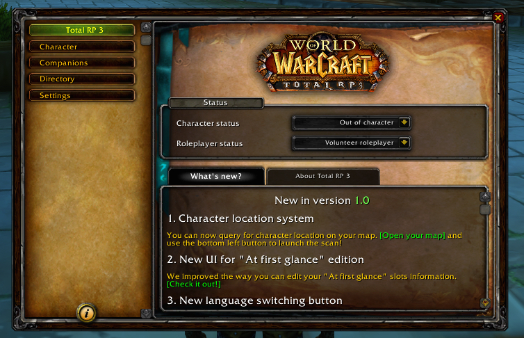

/*
Title: Change-log 1.0.0
*/

## New features

### New player location system

A new button has been added to the lower left corner of your world map. It will list the different scans available. 

The first scan available is for seeing other Total RP users location on the map. You can request player location from any map you are currently viewing, not just for the current zone. Players with the location system enabled will reply to your request and you will be able to see them as dot on you map. This features works with users of Total RP 3 and Total RP 2 (requires Total RP 3 version 1.0 or higher, or Total RP 2 version 1.032 or higher).

*This feature is meant to help players spot where others tend to gather. In order to prevent abuses on PvP realms, we've added an option to stop responding to location request when you are flaged as PvP, available under the Interface tab of the settings. You can also choose to stop responding to request when you are flaged as Out Of Character.*

### New at-first-glance UI

The UI for editing your at-first-glance items has been improved. You can double click on a slot to quickly enable/disable it. You can right-click on a slot to load a preset.

You can now edit your at-first-glance from the at-first-glance bar on the target bar while targerting yourself or one of your companions.

### New language switching button

A new button has been added to the toolbar and to the list of available DataBroker buttons for quickly switching between the languages known by your character (meaning the ones given to you by the game, your racials and the ones provided by the mage glyph). 

### New "What's new" section

A new "What's new" section appeared on the dashboard. It will list the important new stuff for every new version, with interactive links that you can click to try the new features.

### Updated images, icons and sounds

We've updated the list of ressources you can choose from with the news ones from patch 6.1.

### Protection for oversized saved variables

In previous version, when Total RP 3 saved data reached a size threshold, all data were lost. In order to prevent losing your data, we've separated your personal data from the data collected from others (their profiles, their companions, etc.). The module Total RP 3 Data is where data from other players are stored, your data are still stored in the core Total RP 3 module. This is more of a temporary workaround and will be subject to future enhancement.

## Bug fixes

* Fixed a Lua error when entering special characters in the search box of the icon and sound pickers.
* Fixed an issue with lowercase and uppercase when sorting by name in the register.
* Minor bug fixes and improvements.