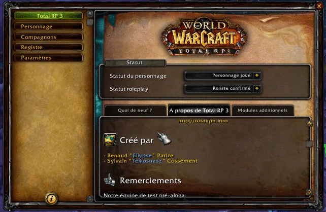

/*
Title: Change-log 1.0.1
*/

## New features

### Residence coordinates

You can now place your character's residence on the map by using the "set position" button next to the residence field while editing characteristics. 

Players will be able to see that mark on the map when reading your profile.

### Directory automatic purge

World of Warcraft is not without bugs, and an annoying one is that when the saved data for an addon reach a certain size threshold, it gets wiped out.
To reduce the chances that you reach the data limit, we've implemented an automatic directory purge removing profiles from characters you've never seen or seen more than 5 days ago and that has no relation affected to them.

You can change this behaviour in the settings.

## Send us a tweet from within the game

We have a new type of tag we are pioneering on the dashboard, in the about tab : Twitter tags. With Twitter tags, you can click a Twitter handle to send a tweet to that user or right-click to get the link to the Twitter profile of that user. If you have an issue or a question, you can send us a tweet (with a screenshot attached even) in English or French and we will get back to you shortly. (Please note that Ellypse is a more avid Twitter user than Telkostrasz, so you might get a quicker response tweeting at Ellypse ;))

Twitter tags will be available for your own descriptions in the next version.

## Bug fixes

* Minor bug fixes and improvements.